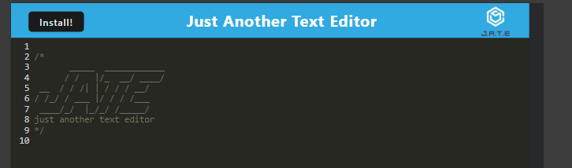
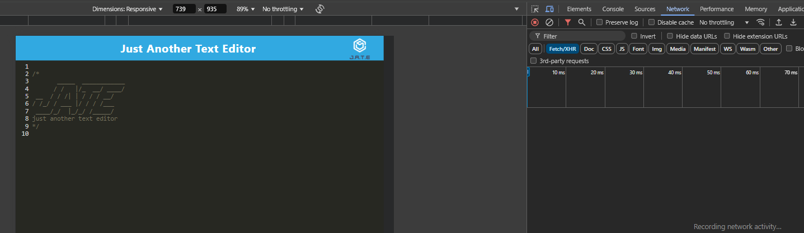

# webpack-workbox-jate

***
## Table of content
- webpack-workbox-jate
  - [Description](#description)
  - [Installation](#installation)
  - [Usage](#usage)
  - [Contributing](#contributing)
  - [License](#license)
  - [Questions](#Questions)
  - [Screenshot](#Screenshot)
***
## Description
[Live link, may take up to 50secs to deploy](https://webpack-workbox-jate.onrender.com/)  
This is to practice PWA - service worker via workbox that packages a text editor - Just Another Text Editore(JATE).

***
## Installation
1. Use Chrome to open the [Live link](https://webpack-workbox-jate.onrender.com/) 
2. Install the service worker when prompted, or click the button.

***
## Usage
1. Try to use JATE in a offline state.  In Chorme > F12 to open Dev Console > Network Tab > Throttle as offline.
2. JATE should work even if it's offline.
3. Once installed, JATE nught be accessible from desktop.
4. JATE should save/load data between uses. 

***
## Contributing
Contact me.  Find my information in the [Questions](#Questions) section.

***
## License
This project adopts WTFPL license practices. Check the website for license details: [License: WTFPL](http://www.wtfpl.net/about/)

***
## Questions
[momokokong's GitHub profile.](https://github.com/momokokong)

[Po Shin Huang Linkedin profile](https://www.linkedin.com/in/poshinhuang/)

***
## Screenshot
- JATE UI and install button.

- Throttle with offline and try JATE in offline state.
